# SISTEMAS DE CONTROL DE VERSIONES - 1ª PRACTICA

## 'Por Kevin Camós" 
## `GitHub Pages https://kevincamos.github.io/practicaDesp1/`

`¿Qué es git?`

Git es un un sistema distribuido de control de versiones, gratuito y de código abierto bajo licencia GPLv2. Fue diseñado originalmente por Linus Torvalds, el creador de Linux.

Gracias a Git, los desarrolladores tienen una gran facilidad para compartir su código, guardar los avances de sus proyectos, poder volver a atrás guardando un "histórico", además de permitir el uso de ramas y las metologías que nos permite y vamos a usar en este proyecto.

`¿Qué es una metodología en GIT y cual vamos a utilizar?`

En Git la denominación "metología" se refiere a la estrategia de trabajo para un proyecto, la forma de ramificar el proyecto y en qué puntos reunificar las ramas bifurcadas con "git merge nombreDeLaRama"

La utilizado por el equipo sería la metología acorde con "Git Flow" con alguna pequeña variación, en la qual sobre la rama Master no se desarrolla código, solamente se hacen "merges" en momentos definitivos del proyecto, donde se le etiqueta una versión. En la rama que trabajamos al largo de la aplicación es la rama "developer" que es de la cual se hacen las ramas para los pequeños servicios y en la qual se hacen merge.

La mayor diferencia de "Git Flow" con nuestra metología utilizada es que dada la promiscuidad de realizar el proyecto por parte del equipo y su baja experiencia, las ramas en las que se realizaban los pequeños servicios erroneamente no han iniciado con la ruta "feature/" generando así un poco de desconcierto al observar las ramas actuales y poder diferenciar las ramas principales de estas "subramas" de una forma rápida y eficaz.

## `PRACTICA EN GIT`

### `1 - Iniciando el repositorio y creando ramas. Usuario 1`

#### 1.1 - Init del repositorio.

El usuario 1 que es el más experimentado, en este punto se encarga de crear el repositorio del proyecto e implementar la estructura inicial.

```
$ git init
```

```
$ git add .
```

```
$ git commit -m "primer commit"
```

```
$ git remote add origin -rutaProyecto
```

```
$ git push -u origin main
```

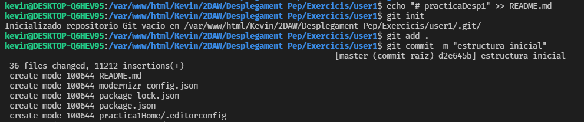
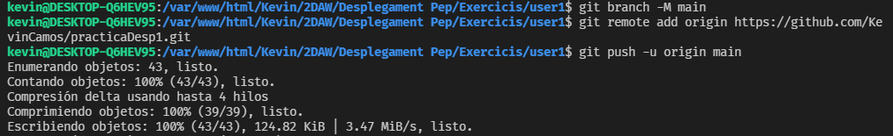

#### 1.2 - Iniciando la ramificación.

Tras crear la estructura inicial, el usuario 1 crea la rama developer, y luego la rama creandoHome.

```
$ git checkout -b developer
```

```
$ git checkout -b creandoHome
```


#### 1.3 - Desarrollando el producto.

Sobre la rama actual "creandoHome", el usuario 1 desarrolla su código para dejar el home como acordó.


#### 1.4 - Subiendo cambios y añadiendolos a la rama de desarrollo.

Tras esto éste realiza un commit con el nuevo código y lo sube al repositorio remoto, sobre la rama "creandoHome", vuelve a la rama de desarrollo y hace un merge de "creandoHome".

```
$ git push --set-upstream origin creandoHome
```

```
$ git checkout developer
```

```
$ git merge creandoHome
```


### `2 - Trabajando sobre un proyecto en equipo . Usuario 2`

#### 2.1 - Desarrollando una primera rama sobre la rama developer.

El usuario 2 crea la sección de “Modificar contenido HTML” tras actualizar su desactualizada rama de developer.

```
$ git checkout developer
```

```
$ git pull origin developer
```

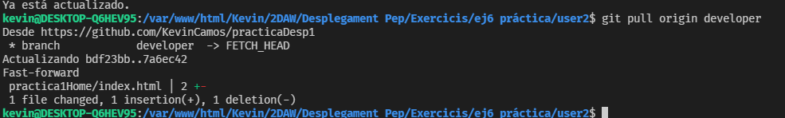

```
$ git checkout -b modContenido
```

Tras añadir una nueva funcionalidad a la rama modContenido el usuario 2 decide guardar los cambios, volver a la rama developer, añadirle los cambios.

```
$ git push --set-upstream origin modContenido
```

```
$ git checkout developer
```

```
$ git merge modContenido
```

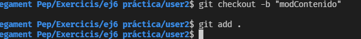

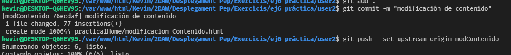

#### 2.2 - Creando una nueva rama para el siguiente objetivo

El usuario 2, tras realizar una primera funcionalidad, termina en la rama modContendio y se embauca en la nueva aventura de desarrollar la sección "Modificar atributos HTML".

```
$ git checkout -b modAtributos
```

```
$ git add .
```

```
$ git commit -m "nombre del commit"
```

```
$ git push --set-upstream origin modAtributos
```

```
$ git checkout developer
```

```
$ git merge modAtributos
```

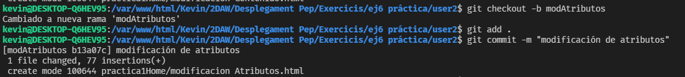

Finalizando así su funcionalidad y añadiendo los cambios como ha hecho anteriormente.

### `3 - El trabajador junior, más inexperto trabaja más precavidamente. Usuario 3`

#### 3.1 - Con más pasos de plomo, antes del pull, un fetch!

El usuario 3 que acaba de llegar a la empresa actualiza su código, pero en lugar de utilizar directamente "pull" como ha hecho su compañero usuario 2, utiliza fetch.

```
$ git fetch
```

Además observa las ramificaciones existentes en el repositorio remoto

```
$ git branch -a
```

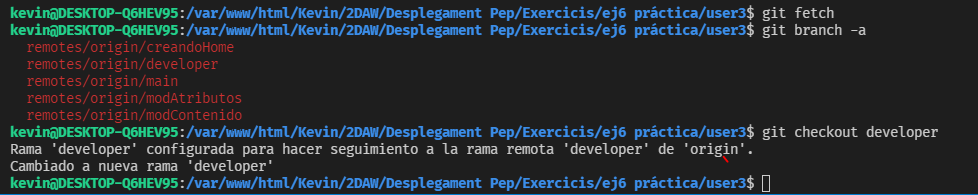

Decidido a obtener los nuevos cambios, se embauca en la rama developer para crear su rama de trabajo.

```
$ git checkout developer
```

```
$ git checkout -b "modCSS"
```

```
$ git add .
```

```
$ git commit -m "nombre del commit"
```

```
$ git push --set-upstream origin modCSS
```

```
$ git checkout developer
```

```
$ git merge modCSS
```

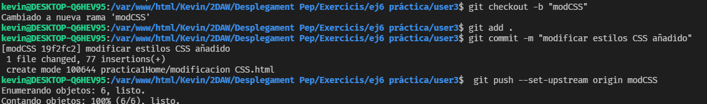

### `4 - Tras llegar a una primera versión del proyecto, hay que tomar las riendas. Usuario 1`

Tras actualizar el repositorio, el usuario 1 decide que es el momento de llevar a la rama main el proyecto en conjunto y etiquetarlo.

```
$ git checkout main
```

```
$ git merge developer
```

```
$ git tag -a v1.0
```

```
$ git push origin --tags
```

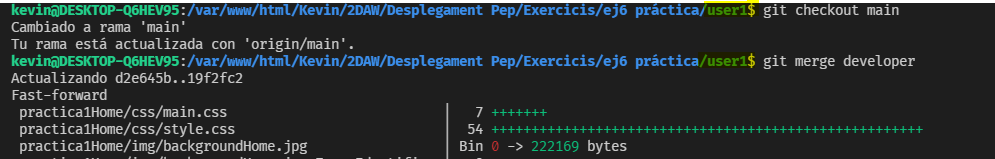
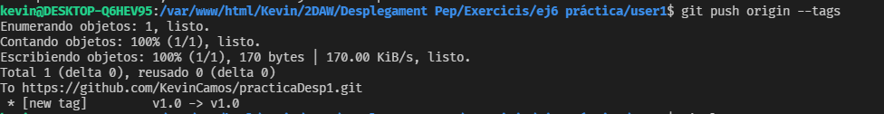

### `5- Trabajando con hooks`

#### 5.1 - Installar node_modules post-checkout

```sh
#!/bin/bash

echo "Este es el hook post-checkout";
npm install .
```

Muestra del correcto funcionamiento del hook

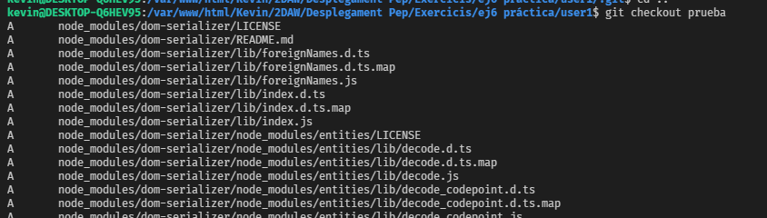

#### 5.2 - Installar node_modules post-clone

```sh
#!/bin/bash

echo "Este es el hook post-clone";
npm install
```

#### 5.3 - Verificación del formato de mensaje de commit en commit-msg

```sh
#!/bin/sh

if ! grep -iqE "MOTIVO DEL COMMIT: "* "$1"; then
    echo "Hay que introducir el campo 'MOTIVO DEL COMMIT: '"
    exit 1

elif ! grep -iqE *"IMPLEMENTACION:"* "$1"; then

    echo "Hay que introducir el campo 'IMPLEMENTACION: '"
     exit 1

fi
exit 0

```

Muestra del correcto funcionamiento del hook

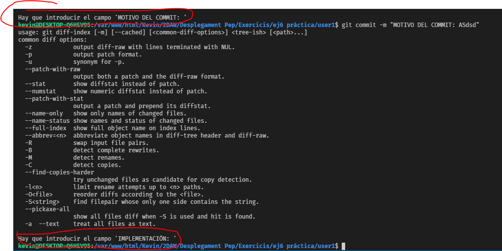

#### 5.4 - Check de carácteres extraños en pre-commit

```sh
#!/bin/sh

LIST="á\|â\|à\|é\|è\|ê\|í\|ì\|î\|ó\|ò\|ô\|ú\|ù\|û"

if git rev-parse --verify HEAD >/dev/null 2>&1; then
    against=HEAD
else
    against=4b825dc642cb6eb9a060e54bf8d69288fbee4904
fi

for FILE in `git diff-index --name-status --cached $against -- | cut -c3-` ; do
    # Check if the file contains one of the words in LIST
    if grep -w *$LIST* $FILE; then
      echo $FILE."Ninguno de estos carácteres es valido => 'áâàéèêíìîóòôúùû'"
      exit 1
    fi
      done
exit
```

Muestra del correcto funcionamiento del hook

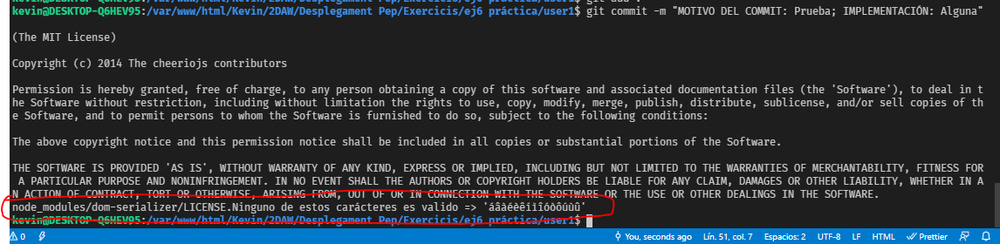

### `6- Eslint-plugin-html`

#### 6.1 - Instalando el plugin "Eslint-plugin-html"

```
npm install --save-dev eslint-plugin-html
```

#### 6.2 - Configuración de eslint

Esta configuración nos permite comprobar la tabulación y además nos informa de tener una mala tabulación. Configuración añadida en 'package.json' 

```json
"settings":{
    "html/indent":"tab",
    "html/report-bad-indent":"error"
}
```
